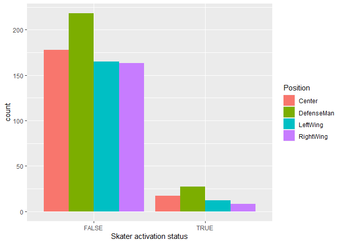
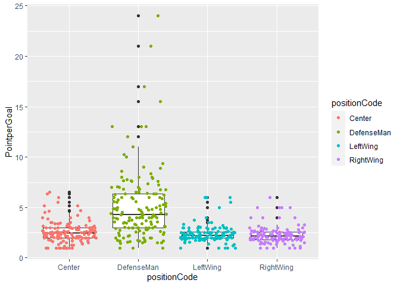
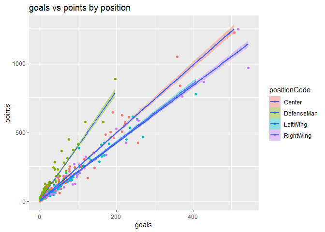
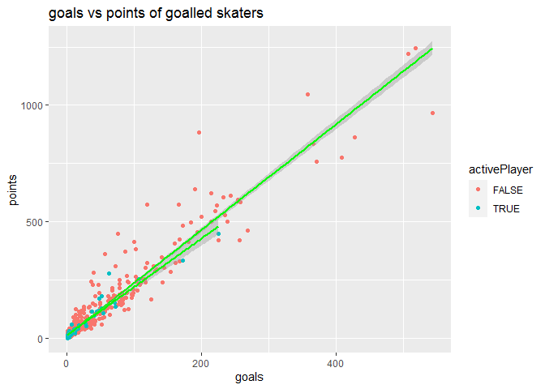

Project 1
================
Kan Luo
6/3/2020

# **JSON**

## What is JSON

**JavaScript Object Notation** (**JSON** is a common data format
specified by [Douglas
Crockford](https://en.wikipedia.org/wiki/Douglas_Crockford) since early
2000s, standardized in 2013, and published in 2017.

<!-- -->

### Characters

JSON is a data interchange format to store information with following
characters:

  - Open standard  
  - Lightweight  
  - Text-based  
  - Human-readable  
  - Language-independent  
  - Filename extension uses `.json`  
  - Official media type (MIME) is “`application/json`”. Unofficial MIME
    type include “`text/json`” and “`text/javascript`”.
    [Reference](https://en.wikipedia.org/wiki/JSON#Security_considerations)

### Data type

#### String

  - **Deinfiition**: A sequence of zero or more unicode characters
    inside a pair of double quotations, or backslash escaping syntax.  
  - **Syntax**: `"string_name" = "string_value"`  
  - **Example**:  
    `{"Name": "Deckard Cain"}`

#### Number

  - **Deinfiition**: Signed decimal number, can contain a fractional
    part or E notation, but not NaN.  
  - **Syntax**: `string: number_value`  
  - **Example**:  
    `{"Age": 86}`

#### Boolean

  - **Deinfiition**: The value of `true` or `false`.  
  - **Syntax**: `string: true/false`  
  - **Example**:  
    `{"isAlive": true}`

#### Object

  - **Deinfiition**: Curly bracket covered name-value pairs, uses commas
    to separate each pairs.  
  - **Syntax**: `string:{"name1": value1, "name2": value2}`  
  - **Example**:  
    `{`  
    `"Character":{"name":"Cain", "Age": 86, "Organization":
    "Horadrim"}`  
    `}`

#### Array

  - **Deinfiition**: Square bracket covered ordered list of more than
    zero values, the values can be different types. Also use commas to
    separate each elements.  
  - **Syntax**: `string:[value1, value2, value3]`  
  - **Example**:  
    `{`  
    `"Characters":["Sor", "Pal", "Nec"]`  
    `}`

#### Null

  - **Deinfiition**: For empty values.  
  - **Syntax**: `string: null`  
  - **Example**:  
    `{ "middlename": null }`

#### Whitespace

  - **Deinfiition**: Allowed and ignored around or between syntactic
    elements.  
  - **Four types**:
      - space  
      - tab  
      - line feed  
      - carriage return

#### Not allowed

  - A Function.  
  - A Date  
  - Undefined  
  - [Reference](https://www.w3schools.com/js/js_json_datatypes.asp)

## Where does JSON used

JSON is the most common used data interchange format in web applications
currently. Many programming languages use this format to store, change
and transmit data between client and server.The [article written by
Jayanth
Babu](https://levelup.gitconnected.com/5-uses-of-json-stringify-json-parse-9b79cb4d9645)
described five real use cases of JSON:

  - Storing and retrieving data from localStorage or sessionStorage  
  - Fetch the data from a server  
  - Stringify the body when making a POST request  
  - Deep cloning a JavaScript object  
  - Convert any data type into a string (serializing)

## Why store data with JSON

JSON is an alternative to
[XML](https://en.wikipedia.org/wiki/XML#:~:text=Extensible%20Markup%20Language%20\(XML\)%20is,free%20open%20standards%E2%80%94define%20XML.).
To tell the advantage of using JSON, we often need to compare it with
XML from multiple aspects.

  - **Lightweight**: JSON is more compact than XML, it’s lightweight
    feature makes improvements in RESTful APIs working with complex
    systems. JSON also faster than XML, and it’s overall less data
    feature can help reduce storage space
    [Reference](https://blog.cloud-elements.com/using-json-over-xml).  
  - **Readable**: Json’s is readable and easy to understand for human.  
  - **Easy to consume**: Can use `eval( )` to consume JSON data in
    JavaScript.  
  - **Compatibility**: Because JSON is text, it is compatible for many
    programming languages, including R.

# R Packages for reading JSON.

## Pull a raw data

We can use the “`GET`” function in “`httr`” package to pull raw data
from a API url address,with following steps:

  - Install and load the httr package.  
  - We can create vectors storing information including base url,table
    name, user name, password, etc..  
  - Using “`paste0`” function, we can create the url of target JSON
    tabel.  
  - Using “`GET`” function from “`httr`” package, we can pull and store
    the raw data from API.  
  - Using “`content(data,"text")`” function, we can convert the raw data
    into JSON text form.

Detailed steps can be references by the [article from Andrew
Carpenter](https://www.programmableweb.com/news/how-to-access-any-restful-api-using-r-language/how-to/2017/07/21).

Then we can use R packages/functions to transform the JSON data into the
flat form that we can easier work with.

## Read in a JSON data

There are three major packages / functions we can use to read a JSON
into R.

  - **rjson**
      - First carried out by *Alex Couture-Beil* in 2007.  
      - Doesn’t use R’s S4/S3 methods, so not readily extensible.  
      - Does not use vectorized operations, so will be slow to read
        non-trivial data and big data.  
      - Use “`fromJSON`” function to convert JSON data into list.
  - **rjsonio**
      - Started by *Duncan Temple Lang* on GitHub in 2010.  
      - Use R’s S4/S3 methods, so it’s extensible.  
      - Uses a C++ library, faster than `rjson`.  
      - Also use “`fromJSON`” function to the conversion.  
      - Has more options, for example, use `digits=` option to specify
        floating point precision for numeric data.  
      - Support Unicode, but not support utf-8.
  - **jsonlite**
      - A fork of `rjsonio` started in 2013, so has most of `rjsonio`’s
        advantages.  
      - Has even more useful options than `rjsonio`.
      - Support utf-8.

[Reference](http://anotherpeak.org/blog/tech/2016/03/10/understand_json_3.html)

In the following work, I will choose `jsonlite` because it has the most
available option choices, which can help handling the data. And it can
support utf-8.

# NHL Records API Documentation

## Pull “Franchise” records

Following function `NHL` helps pulling franchise data from [NHL Records
API](https://gitlab.com/dword4/nhlapi/-/blob/master/records-api.md)
includes those aspects:

  - `/franchise` (Returns id, firstSeasonId and lastSeasonId and name of
    every team in the history of the nhl)  
  - `/franchise-team-totals` (Returns Total stats for every franchise
    (ex roadTies, roadWins, etc))  
  - `/franchise-season-records?cayenneExp=franchiseId=ID` (Drill-down
    into season records for a specific franchise)
      - User can specify ID values.  
  - `/franchise-goalie-records?cayenneExp=franchiseId=ID` (Goalie
    records for the specified franchise)
      - User can specify ID values.  
  - `/franchise-skater-records?cayenneExp=franchiseId=ID` (Skater
    records, same interaction as goalie endpoint)
      - User can specify ID values.

<!-- end list -->

``` r
NHL <- function(calls = "franchise", id = NULL){  #Default calls franchise with id null.
  base_url <- "https://records.nhl.com/site/api"
  if (missing(id)){  #1st if, check if there is a ID number, if not, can only pull franchise or team total data.
    if(calls == "franchise") {ext_url <- "/franchise"}  #1st if true, then 2nd if check if it is calling franchise data.
      else if(calls == "total") {ext_url <-"/franchise-team-totals"}  # 2nd if false, then 3rd if check if it is calling total data.
    else {stop("Calls franchise or total when no ID number")}  #2nd if false, stop and send message.
  }
    else if(calls %in% c("season", "goalie", "skater")){  #1st if false, has a id, 4th if check if the valied id-related category been called.
    ext_url <- paste0("/franchise-",calls,"-records?cayenneExp=franchiseId=",id)  #4th if true, then use paste0 to generate the extension url
  }
      else {stop("Only season, goalie or skater when ID applied")}  #4th if false, not the valied category, stop and send message.
  full_url <- paste0(base_url, ext_url) #create a full url
  data1 <- GET(full_url) %>% content("text") %>% fromJSON(flatten = TRUE) #grab the data and convert it into a list.
  data2 <- data.frame(data1[1])  #convert the list into data frame.
  names(data2) <- substring(names(data2), 6)  #remove the "data." prefix in column names.
  NHLTibble <- tbl_df(data2)  #convert the data frame into tibble.
  if (calls == "season"){  #Noticed season data always has 1 row and multiple columns, use gather function to change it into long form for easier reading.
    NHLTibble <- gather(NHLTibble, key = SeasonInfo, value = Value)
  }
return(NHLTibble)  #return the tibble.
}
```

## Data analysis

### Read in data

With above function, we pull out Montréal Canadiens’s skater table for
analysis.

``` r
skater_1 <- NHL(calls = "skater", id=1)  #pull data by function.
names(skater_1)  #See the variable names
```

    ##  [1] "id"                          "activePlayer"               
    ##  [3] "assists"                     "firstName"                  
    ##  [5] "franchiseId"                 "franchiseName"              
    ##  [7] "gameTypeId"                  "gamesPlayed"                
    ##  [9] "goals"                       "lastName"                   
    ## [11] "mostAssistsGameDates"        "mostAssistsOneGame"         
    ## [13] "mostAssistsOneSeason"        "mostAssistsSeasonIds"       
    ## [15] "mostGoalsGameDates"          "mostGoalsOneGame"           
    ## [17] "mostGoalsOneSeason"          "mostGoalsSeasonIds"         
    ## [19] "mostPenaltyMinutesOneSeason" "mostPenaltyMinutesSeasonIds"
    ## [21] "mostPointsGameDates"         "mostPointsOneGame"          
    ## [23] "mostPointsOneSeason"         "mostPointsSeasonIds"        
    ## [25] "penaltyMinutes"              "playerId"                   
    ## [27] "points"                      "positionCode"               
    ## [29] "rookiePoints"                "seasons"

This tibble has 788 observations and 30 variables. we firstly narrow
down the tibble by selecting the variables we want to work with.

``` r
skater_1_small <- skater_1 %>% select(id, activePlayer, goals, points, positionCode)  #subset columns by select function.
skater_1_small$positionCode <- as.factor(skater_1_small$positionCode)  #Convert the positioncode column into factor
skater_1_small$positionCode <- revalue(skater_1_small$positionCode, c("C" = "Center", "L" = "LeftWing", "R" = "RightWing","D" = "DefenseMan"))  #Change the abbreviations for readable.
head(skater_1_small)  #preview the small table
```

    ## # A tibble: 6 x 5
    ##      id activePlayer goals points positionCode
    ##   <int> <lgl>        <int>  <int> <fct>       
    ## 1 16891 FALSE          507   1219 Center      
    ## 2 16911 FALSE          358   1046 Center      
    ## 3 16990 FALSE          544    966 RightWing   
    ## 4 17000 FALSE          518   1246 RightWing   
    ## 5 17025 FALSE           88    175 RightWing   
    ## 6 17054 FALSE          408    776 LeftWing

### Contingency tables view

We can firstly look at the skaters in each position:

``` r
table1 <- table(skater_1_small$positionCode)
kable(table1, caption = "Skater number count of each position")
```

| Var1       | Freq |
| :--------- | ---: |
| Center     |  195 |
| DefenseMan |  245 |
| LeftWing   |  177 |
| RightWing  |  171 |

Skater number count of each position

This one way table produced by `table` function gives the count of
skaters at each positions. Left and right wings have same number of
skaters, center position is a little more, and defenseman is most.

We can also see if the players in each position had goals or not.

``` r
skater_1_small <- skater_1_small %>% mutate(GoalorNot = (ifelse(goals>0,"Goal","NotGoal")))  #Create a new column to identify the skater had goal or not.
table2 <- table(skater_1_small$GoalorNot, skater_1_small$positionCode)
kable(table2, caption = "Skater number counts of position by goal or not ")
```

|         | Center | DefenseMan | LeftWing | RightWing |
| ------- | -----: | ---------: | -------: | --------: |
| Goal    |    144 |        155 |      128 |       127 |
| NotGoal |     51 |         90 |       49 |        44 |

Skater number counts of position by goal or not

This two way table shows the count of skaters had at least one goal or
never had goal. Roughly speaking, the ratios of Goal vs Notgoal among
center, left and right wing skaters are around 3, while the defenseman
has ratio less than 2. It shows defenseman is less likely to have a
goal.

We can further look at the 3rd dimension of active status

``` r
table3 <- table(skater_1_small$GoalorNot, skater_1_small$positionCode, skater_1_small$activePlayer)
kable(table3[,,1], caption = "Non-active skater number counts")
```

|         | Center | DefenseMan | LeftWing | RightWing |
| ------- | -----: | ---------: | -------: | --------: |
| Goal    |    129 |        137 |      116 |       120 |
| NotGoal |     49 |         81 |       49 |        43 |

Non-active skater number counts

``` r
kable(table3[,,2], caption = "Active skater number counts")
```

|         | Center | DefenseMan | LeftWing | RightWing |
| ------- | -----: | ---------: | -------: | --------: |
| Goal    |     15 |         18 |       12 |         7 |
| NotGoal |      2 |          9 |        0 |         1 |

Active skater number counts

The first subtable shows the skaters with active status is FALSE, and
the lower sub-table shows the TRUE group. We can see the actived skaters
are much fewer than the non-actived playes, but they have higher Goal vs
NotGoal ratio in every position.

### Bar plot view

Can make a side by side bar graph to compare the number of skaters with
their sctivation status. We can see most of the skaters were non-active,
but active and non-active had similar distribution shapes.

``` r
g <- ggplot(data = skater_1_small, aes(x=activePlayer)) 
g + geom_bar(aes(fill = positionCode), position = "dodge") +
  scale_fill_discrete(name="Position") +
  labs(x= "Skater activation status")
```

<!-- -->

### Box plot view

We can compare the points and goals earned from each position. We can
see there is not much difference in the ability of making goals or
earning points among skater’s positions. Some players made extremly high
points/goals while most of the others were low. Seems it’s more depening
on person ability.

``` r
g2 <- ggplot(data=skater_1_small, aes(x = positionCode, y = points))
g2 + geom_boxplot() + geom_point(aes(fill = positionCode, colour = positionCode),position = "jitter") + ggtitle("Pointes earned by position")
```

<!-- -->

``` r
g3 <- ggplot(data=skater_1_small, aes(x = positionCode, y = goals))
g3 + geom_boxplot() + geom_point(aes(fill = positionCode, colour = positionCode),position = "jitter") + ggtitle("Goals made by position")
```

<!-- -->

Then let’s select the players had goals.

``` r
goal <- skater_1_small %>% filter(goals > 0)  #subset rows by filter function.
```

Create a new variable PointperGoal = points / goals.

``` r
goal2 <- goal %>% mutate(PointperGoal = (points/goals))
```

We can create a box-plot to compare the efficiency of earn points among
each position. From the plot, we can see the defenseman had higher
efficiency in earning points than the other three positions. It seems
skater’s positions can some how affect their pointing efficiency.  
<!-- -->

### Scatter plot view

Then we can do a scatter plot on goals vs points by each group. The
defenseman has largest slope, indicates this group has higher efficiency
in earning points. Left and right wings are very similar, which are a
little lower than center position.

<!-- -->

Last, we can do a scatter plot of goals vs points of all skaters that
had at least one goal. It is obvious that the more goals a skater made,
the higher points he would earn. But the active skater seems had no
difference to the non-active skaters on this aspect.

``` r
g6 <- ggplot(goal2, aes(x = goals, y=points, group = activePlayer))
g6 + geom_point(aes(colour = activePlayer)) +  geom_smooth(method = lm, colour = "green") + ggtitle("goals vs points of goalled skaters")
```

<!-- -->
